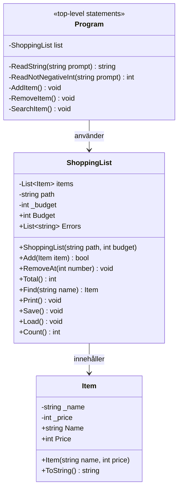

# Inköpslistan

## Buggrapport

### Bugg 1: IndexOutOfRangeException

**Problem:** Första buggen är en `System.IndexOutOfRangeException`. Detta händer eftersom det skapas 4 lines istället för 3 där en line har bara en part som är tom. Och när man försöker lägga till `part[1]` så finns den inte och då får man en crash. Man får även en extra `\r` på slutet som man behöver ta bort.

**Fix:** Ändra `ReadAllText` => `ReadAllLines` som automatiskt tar bort `\r` i slutet och skapar inte en extra tom line. Lägger till en `if` som kollar om det finns en tom line i txt. Om det finns blir den ignorerad.

---

### Bugg 2: Total räknar fel

**Problem:** `Total`-metoden räknar fel på total price.

**Fix:** Fixat genom att ändra `int i = 1` till `int i = 0`. Detta hände eftersom den räknade inte med första item i listan

---

### Bugg 3: Tom sträng som namn

**Problem:** Om man lägger till en vara kan den läggas till med en tom sträng.

**Fix:** Fixat genom att använda metoder som kollar att string inte är empty. Namn med bara spaces är fixat med `IsNullOrWhiteSpace`. 

---

### Bugg 4: Krasch vid fel typ av pris

**Problem:** Programmet crashar om man skriver något annat än en `int` när man lägger till en vara.

**Fix:** Fixat genom att använda metoder som kollar att det är en `int` och inte är negativt.

---

### Bugg 5: Krasch vid borttagning av vara som inte finns

**Problem:** Programmet crashar om man väljer ett nummer som inte finns på remove.

**Fix:** Fixat genom att använda helper metoderna och en egen metod för just remove så att man kan bara ta bort om man skriver ett nummer som finns på listan.

---

### Bugg 6: Krasch vid ogiltigt menyval

**Problem:** Programmet crashar om man inte väljer en av dem 5 alternativen i menyn.

**Fix:** Fixat genom att lägga en `if` innan meny valen som kollar att man väljer en av de 5 alternativen.

---

### Bugg 7: Sökresultatet syns inte

**Problem:** Programmet skriver inte ut om varan hittades eller inte när man söker efter den.

**Fix:** Fixat genom att lägga till `Console.ReadKey()` efter utskriften.

---

### Bugg 8: Krasch om filen saknas

**Problem:** Programmet crashar om den inte hittar filen (`items.txt`).

**Fix:** Fixat genom att lägga till `File.Exists(path)` i `Load`. Den kollar om det finns en fil vid det namnet i `path` och returnerar en boolean.

Om den är `true` så går den vidare eftersom `!true` blir `false` och kör resten av koden. Om den är `false` så kommer den gå in i `if` och bara gå ut från metoden. Då har man en tom lista där man kan forfarande lägga till grejer.

Om man sedan sparar listan så skapas det en ny `items.txt` automatiskt. Detta är eftersom `File.WriteAllText` kollar om det finns en fil vid det namnet. Om det inte finns så skapar den det automatiskt och skriver i den.

Om filen finns så rensar den allt i filen och skriver om det.

---

### Bugg 9: Tom catch i Save

**Problem:** Catch under `Save`-metoden fångar ingeting.

**Fix:** Fixat genom att lägga till 2 `catch` under `try` i `Save`-metoden. Den fångar upp om man inte har access till filen eller om något annat går som tex full hårdisk. Den skriver ut errorsen till användaren.

---

### Bugg 10: Krasch vid trasig rad i filen

**Problem:** Om man manuellt ändrar `items.txt` så att en rad inte följer formatet `pris;namn` kraschar programmet direkt vid uppstart. Exempel på rader som gav krasch: `hej`, `abc;Mjölk`, `-5;Mjölk` och `5;`.

**Varför:** Den gamla `Load()` litade på att varje rad alltid såg ut som `pris;namn`. `parts[1]` finns inte om raden saknar `;`. `int.Parse` kastar `FormatException` om priset inte är ett tal. `new Item(...)` kastar ett undantag om priset är negativt eller namnet är tomt, eftersom `Item` skyddar sig själv.

**Fix:** Fixat genom att lägga till extra felhantering i metoden `Load()`, metoden kollar så att alla `parts` har 2 delar och nu sparar vi varje part i en variabel. `Part[0]` är en `TryParse` nu som kollar om det faktiskt va en `int` som fanns där i txt filen. Baserat på det så försöker den att lägga till en ny item i listan. Om talet tex är `-5` vilket items egna felhantering inte tillåter så kommer den fånga ett fel. Vi kollar alltid att `parts[0]` är en siffra så det är omöjligt att ladda in en fil som är tex `Mjölk;Mjölk`. Alla errors läggs till i en lista som `Program.cs` sedan skriver ut. Där finns ett vilkor som kollar om error listan är tom eller inte. Om den är tom så skippas errors att printa helt o hållet.  

---

### Bugg 11: Namn med `;` försvann efter sparning

**Problem:** Om man lade till en vara med `;` i namnet, tex `Bröd;fullkorn`, sparades den som `10;Bröd;fullkorn`. Vid inläsning blev raden 3 delar och räknades som trasig, så varan försvann.

**Fix:** Ändrade `line.Split(';')` till `line.Split(';', 2)` i `Load()`. Den låter spliten bara hända 1 gång vid `;` så `10;Bröd;fullkorn` blir `10` och `Bröd;fullkorn`.

---

## Item skyddar sig själv

Jag valde att skriva item skyddet i `set` på egenskaperna eftersom om man skriver dem i konstruktorn så finns det inget som stoppar item att ändra värden efter objektet redan finns. Med `set` spelar det ingen roll om item existerar eller inte den kan aldrig få fel värden.

---

## Budget tak

Jag valde att låta `Add` returnera `bool` istället för `try` och `catch` eftersom det bara känns mer bekvämt. `Add` lägger inte till en vara om det överstiger taket.   

I `Add` under `Program.cs` så kollar den om varan kunde läggas till annars skriver den ut felmedellandet.

Jag valde att varor som läses in från filen inte kontrolleras av budgettaket.
Anledningen är att varorna redan har sparats tidigare, och om programmet skulle avvisa
dem vid inläsning skulle de försvinna ur filen nästa gång användaren sparar. Det tycker
jag inte är rättvist, och det skulle bryta mot kravet att sparad data ska överleva en
omstart. Konsekvensen är att listan kan ligga över budgeten efter inläsning. Då avvisar
`Add` alla nya varor tills användaren har tagit bort tillräckligt många varor för att
komma under taket igen.

Jag tycker det är logiskt att en user ska själv få välja sin budgettak så jag låter usern skriva in den innan programmet startar. Detta löser jag genom att skapa en lista som är `null` och kör tills den är inte är `null` längre. Programmet försöker skapa ett objekt av `ShoppingList`. Om budgeten överstiger max gränsen (10 000kr) så kan den inte skapa objektet och fångar ett fel.

--- 

## Klassdiagram

